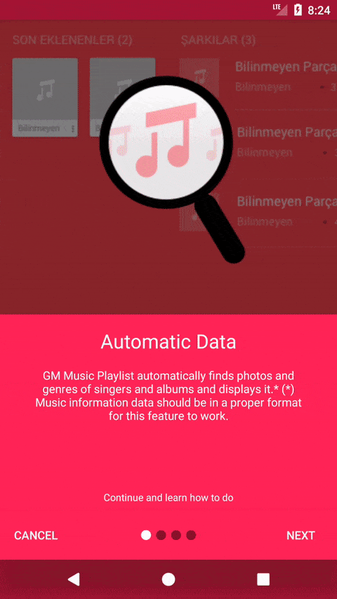

[](https://jitpack.io/#msayan/tutorial-view)

# Tutorial View

Ready to use tutorial screen.



## Usage

Extend your activity from TutorialActivity and Add fragments in onCreate after super call

```java

public class MainActivity extends TutorialActivity {

    @Override
    protected void onCreate(Bundle savedInstanceState) {
        super.onCreate(savedInstanceState);

        addFragment(new Step.Builder().setTitle("This is header")
                                      .setContent("This is content")
                                      .setBackgroundColor(Color.parseColor("#FF0957")) // int background color
                                       .setDrawable(R.drawable.ss_1) // int top drawable
                                      .setSummary("This is summary") 
                                      .build());
        // Permission Step
        addFragment(new PermissionStep.Builder().setTitle(getString(R.string.permission_title))
                                                .setContent(getString(R.string.permission_detail))
                                                .setBackgroundColor(Color.parseColor("#FF0957"))
                                                .setDrawable(R.drawable.ss_1)
                                                .setSummary(getString(R.string.continue_and_learn))
                                                .setPermissions(new String[]{Manifest.permission.READ_EXTERNAL_STORAGE, Manifest.permission.WRITE_EXTERNAL_STORAGE})
                                                .build());
    }
}

```

Some helper methods
```java

setPrevText(text); // Previous button text
setNextText(text); // Next button text
setFinishText(text); // Finish button text
setCancelText(text); // Cancel button text
setIndicatorSelected(int drawable); // Indicator drawable when selected
setIndicator(int drawable); // Indicator drawable
setGivePermissionText(String text); // Permission button text

```

If you want to open another activity on tutorial finish
```java

    @Override
    public void finishTutorial() {
        // Your implementation
    }

```


##### If you want change design of view you need following items
* 1 Container layout with id of container
* 3 Text view which is for Title id of title, Content id of content, Summary id of summary
* 1 Image view with id of image


## Download

### Step 1. Add the JitPack repository to your build file

Add it in your root build.gradle at the end of repositories:

```groovy

	allprojects {
		repositories {
			...
			maven { url 'https://jitpack.io' }
		}
	}
```

### Step 2. Add the dependency

```groovy

	dependencies {
		implementation 'com.github.msayan:tutorial-view:v1.0.10'
	}
  
```

## License

    MIT License
    
    Copyright (c) 2017 Mehmet Ayan
    
    Permission is hereby granted, free of charge, to any person obtaining a copy
    of this software and associated documentation files (the "Software"), to deal
    in the Software without restriction, including without limitation the rights
    to use, copy, modify, merge, publish, distribute, sublicense, and/or sell
    copies of the Software, and to permit persons to whom the Software is
    furnished to do so, subject to the following conditions:
    
    The above copyright notice and this permission notice shall be included in all
    copies or substantial portions of the Software.
    
    THE SOFTWARE IS PROVIDED "AS IS", WITHOUT WARRANTY OF ANY KIND, EXPRESS OR
    IMPLIED, INCLUDING BUT NOT LIMITED TO THE WARRANTIES OF MERCHANTABILITY,
    FITNESS FOR A PARTICULAR PURPOSE AND NONINFRINGEMENT. IN NO EVENT SHALL THE
    AUTHORS OR COPYRIGHT HOLDERS BE LIABLE FOR ANY CLAIM, DAMAGES OR OTHER
    LIABILITY, WHETHER IN AN ACTION OF CONTRACT, TORT OR OTHERWISE, ARISING FROM,
    OUT OF OR IN CONNECTION WITH THE SOFTWARE OR THE USE OR OTHER DEALINGS IN THE
    SOFTWARE.